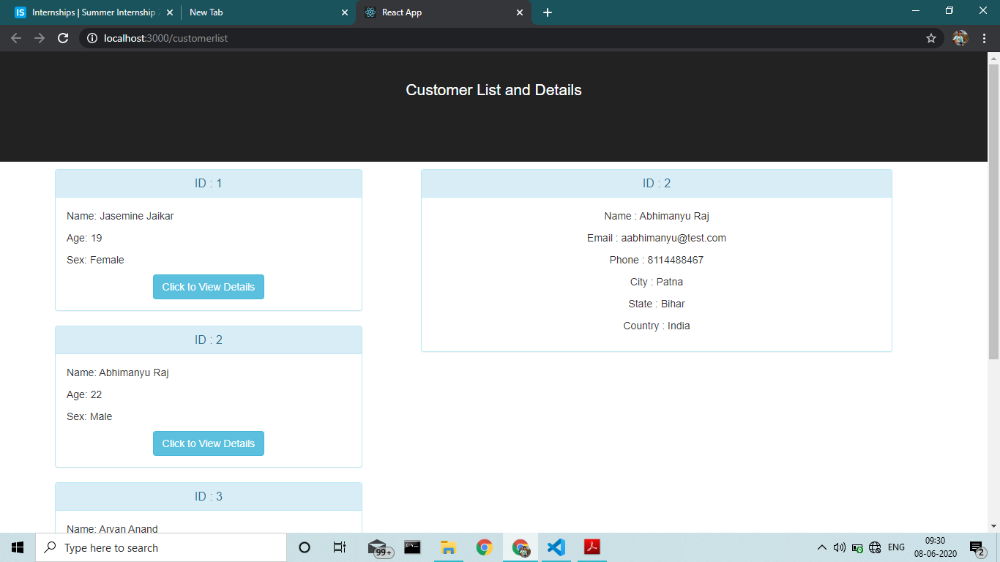
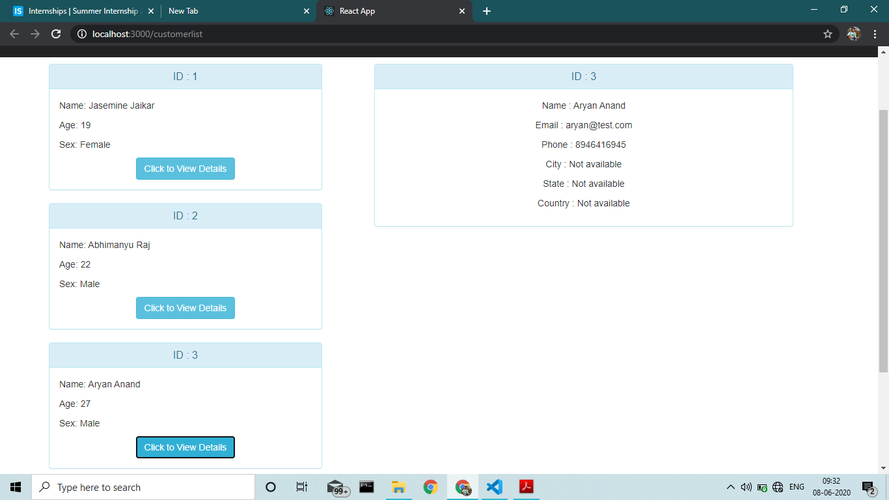

# React JS Project


## Prerequisites

### Install Node JS
Refer to https://nodejs.org/en/ to install nodejs

### Install create-react-app
Install create-react-app npm package globally. This will help to easily run the project and also build the source files easily. Use the following command to install create-react-app

```bash
npm install -g create-react-app
```

## Cloning and Running the Application in local

Clone the project into local machine

Install all the npm packages. Go into the project folder and type the following command to install all npm packages

```bash
npm install
```

If Commandline shows any error then run following command

```bash
npm audit fix
```

In order to run the application Type the following command

```bash
npm start
```

The Application Runs on **localhost:3000**

## Application design

#### Components

1. **Customers** Component : This Component displays a list of customers. This Component gets the data from a json file in assets folder

2. **CustomerDetails** Component : This Component Displays the details and address of the selected customer. This Component gets its data from a json file in assets folder as well.
#### HTTP client

**axios** library is used to make HTTP Calls



